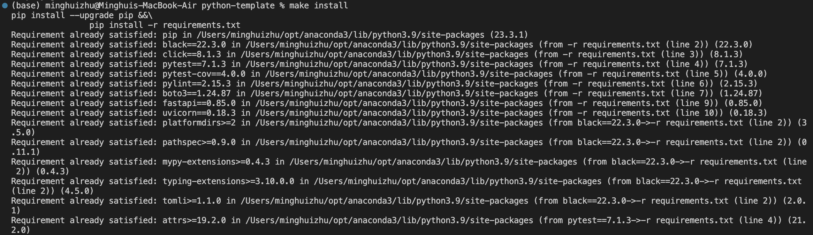
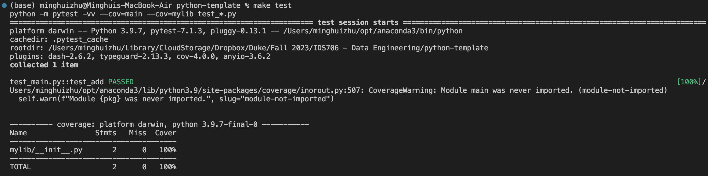
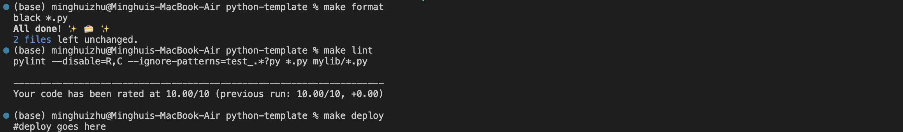
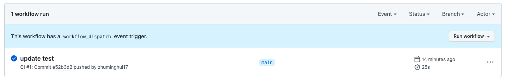

# Project #4: Auto Scaling Flask App Using Azure Container Apps - MBTI Classification

## Project Overview
This Flask web application uses a machine learning model from Hugging Face to classify text into Myers-Briggs Type Indicator (MBTI) personality types. It provides a simple web interface where users can input text and receive a MBTI personality classification. It use Docker Containation.

## Features
- User-friendly web interface for text input.
- Integration with Hugging Face's Inference API for MBTI personality classification.
- Display of classification results in a sorted and readable format.

## Rubric
For this assignment, you will build a publicly accessible auto-scaling container using Azure App Services and Flask. This is an easy way to build and deploy a scaleable web-hosted app and will allow you to apply your Flask knowledge fro m previous lessons.

Your project will be graded on the following criteria:

- A README.md file (15 points): This should clearly explain what the project does, its dependencies, how to run the program, and conclude with actionable and data-driven recommendations to a hypothetical management team.
    - Clarity and completeness of README: 10 points
    - Quality of conclusion and recommendation: 5 points
			
- GitHub Repo (20 points): A complete GitHub Repo that contains all required scripts and documentation to run your application.
		
- Flask App (20 points):	
    - Functionality within Docker/(Platform): 10 points
    - Creativity/sophistication, full credit (all 20 points for this section) will be given to students who have a functioning embedded LLM within Flask: 10 points.
		
		
- Use of DockerHub (Or equivalent) (10 points): Hosting your functioning container on DockerHub.   
- Azure Web App (Or equivalent) (15 points): Successfully deploying your container via Azure Web App to a public endpoint. This can be done either directly from Docker or through Azure container registry.
	
	
- Video Demo (20 points): A YouTube link in README.md showing a clear, concise (2-5min) walkthrough and demonstration of your application. The video should be high-quality (both audio and visual), not exceed the given time limit, and be linked in the README via a private or public YouTube link.
		
		
- Clarity of explanation: 8 points
- Quality demonstration of the project: 7 points	
- Quality of video and audio: 5 points
	

Total: 100 points

This is the Python template for IDS721 Data Engineering Systems.

This document provides an overview of the key components within the project repository.

### `.devcontainer`
- **`Dockerfile`**: Defines the container's build process and environment.
- **`devcontainer.json`**: Contains configuration settings for the development environment in VS Code.

### `workflows`
- Contains GitHub Actions workflows for automated build, test, and deployment pipelines.

### `.gitignore`
- Lists the files and directories that Git should ignore.

### `Makefile`
- Used for automating compilation, testing, and other development tasks on Unix-based systems.

### `README.md`
- Offers instructions and an introduction to the project.

### `main.py`
- The main Python script of the project.

### `requirements.txt`
- Specifies all necessary libraries and packages for the project.

### `test_main.py`
- Test script designed to validate the functionality of `main.py` within IDEs.

### `img`
- Stores screenshots or images of the project's execution results.

## Continuous Integration with GitHub Actions

The project uses GitHub Actions, employing the following commands:

- `make install`: Installs project dependencies.

- `make test`: Runs unit tests.

- `make format`: Formats the code according to the specified style.
- `make lint`: Checks the code for potential errors and style issues.

### CI Results

