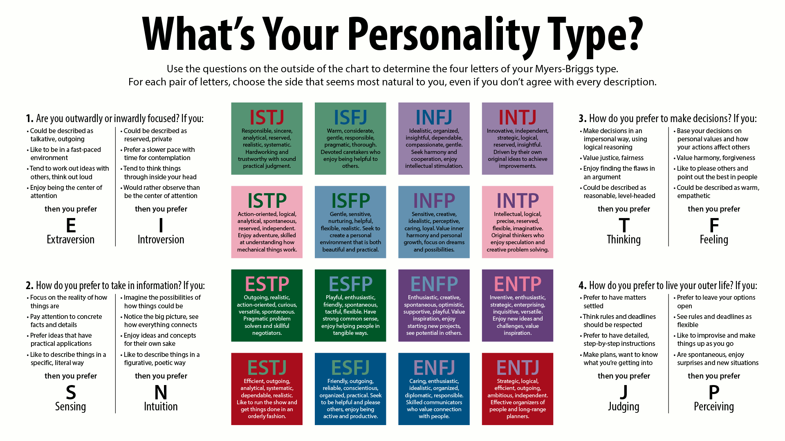
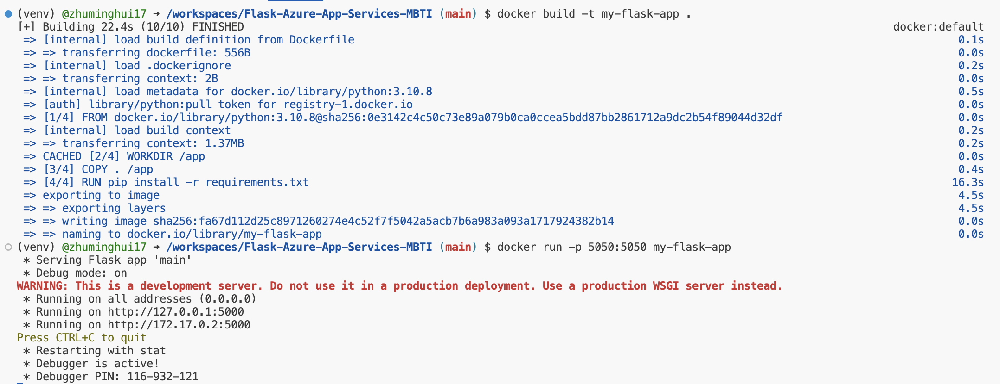
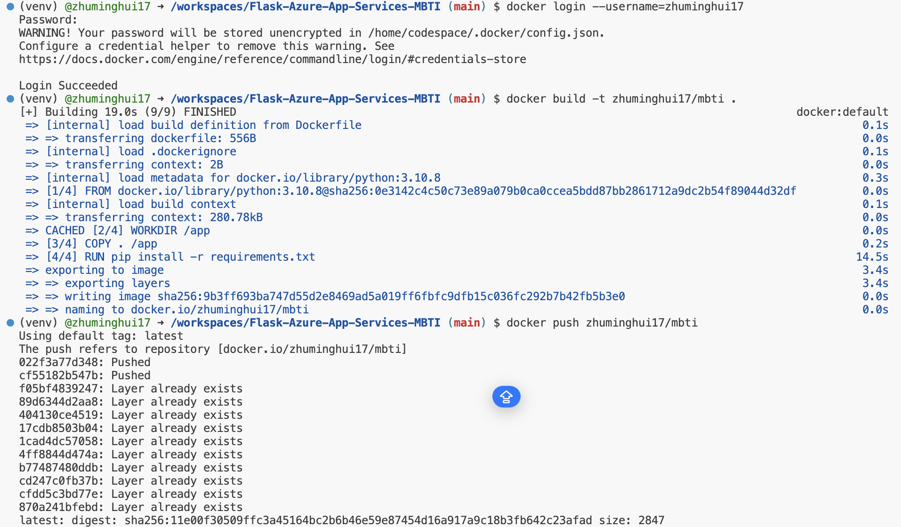
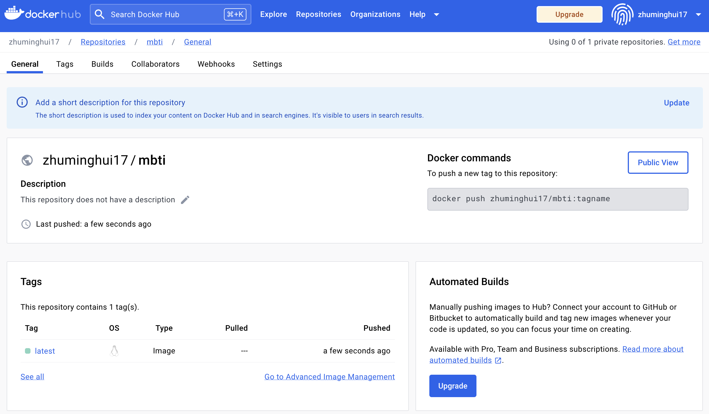
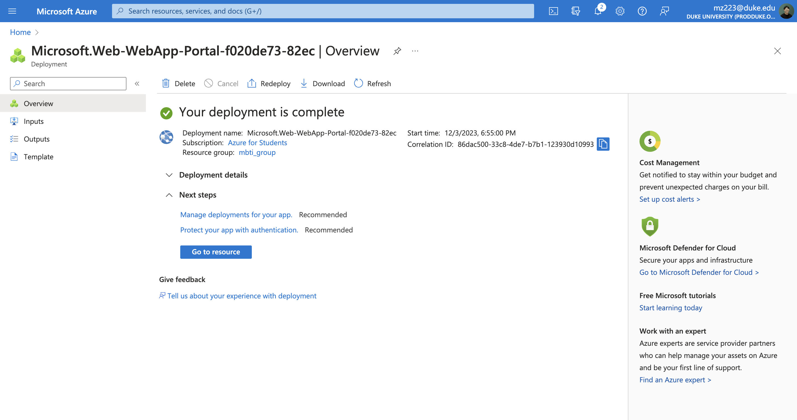
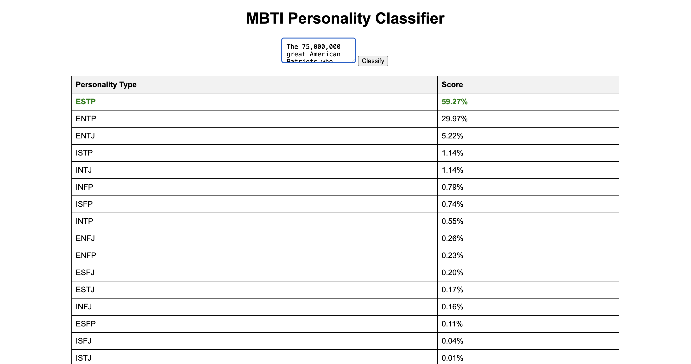

[](https://github.com/zhuminghui17/python-template/actions/workflows/cicd.yml)

# Project #4: Auto Scaling Flask App Using Azure Container Apps - MBTI Classification

https://mbti-flask-app.azurewebsites.net/

## Project Overview
This Flask web application uses a machine learning model from Hugging Face to classify text into Myers-Briggs Type Indicator (MBTI) personality types. It provides a simple web interface where users can input text and receive a MBTI personality classification. It use Docker Containation.
Video Demo: https://youtu.be/jMqgW9K02rE

## MBTI
MBTI, or the Myers-Briggs Type Indicator, is a self-report questionnaire designed to categorize personality types based on Carl Jung’s theory of psychological types. It assesses individuals in four dimensions: Introversion (I) vs. Extraversion (E), Sensing (S) vs. Intuition (N), Thinking (T) vs. Feeling (F), and Judging (J) vs. Perceiving (P). These dimensions combine into 16 distinct personality types (like INTJ, ENFP, ISTP, etc.). The MBTI is used in various settings, including career counseling, team building, personal development, and relationship counseling, to help people understand themselves and others better. It's popular for its straightforward and relatable insights, although its scientific validity and reliability have been subjects of debate in the psychological community.




## Features
- User-friendly web interface for text input.
- Integration with Hugging Face's Inference API for MBTI personality classification.
- Display of classification results in a sorted and readable format.
- Backend: Python, Flask. The app.py is the main file to run the app.
- Frontend: HTML

## Preparation
- Python 3.9
- Flask
- Docker
- Azure Container Registry
- Azure App Services
- Hugging Face
- requests
- gunicorn

## Local Deployment
To run this application locally, ensure Docker is installed on your machine. Follow these steps:

1. **Clone the repository:**
    Use the command below to clone the repository.
    ```
    git clone https://github.com/zhuminghui17/Flask-Azure-App-Services-MBTI
    ```

2. **Build the Docker image:**
    Build your Docker image using the following command.

    ```
    docker build -t my-flask-app .
    ```

3. **Run the Docker container:**
    Run your Docker container with the command below. This will start your app on the specified port.

    ```
    docker run -p 5000:5000 my-flask-app
    ```

### DockerHub Login and Push
To upload the built image to DockerHub, follow these commands:

1. **Docker Login:**
    Log in to your DockerHub account using the command:

    ```
    docker login --username=yourusername
    ```

2. **Build and Tag the Image:**
    Build and tag your Docker image for DockerHub.

    ```
    docker build -t yourusername/reponame .
    ```

3. **Push to DockerHub:**
    Push your Docker image to DockerHub with this command.

    ```
    docker push yourusername/reponame
    ```

> Note: Ensure you have a DockerHub account before proceeding with these steps.





### Set up Azure App Services
When configuring your Azure Web App, it's important to specify the WEBSITES_PORT to match the port you're using. In this instance, set it to 5000.





## Conclusion with actionable and data-driven recommendations
Project #4 demonstrates a strong implementation of technology for MBTI personality classification. To further enhance this project, the management team should consider:

- **Implement Performance Monitoring**: Utilize tools like Azure Monitor for performance tracking and enable auto-scaling to manage resource usage efficiently.
- **Gather User Feedback**: Collect user insights to improve the UI/UX and refine the ML model for more accurate predictions.
- **Enhance Security and Compliance**: Regularly update security measures and ensure adherence to data protection laws.
- **Expand Features and Market Reach**: Introduce new features based on user data and seek strategic partnerships to broaden the application's impact.

## Rubric
For this assignment, you will build a publicly accessible auto-scaling container using Azure App Services and Flask. This is an easy way to build and deploy a scaleable web-hosted app and will allow you to apply your Flask knowledge fro m previous lessons.

Your project will be graded on the following criteria:

- A README.md file (15 points): This should clearly explain what the project does, its dependencies, how to run the program, and conclude with actionable and data-driven recommendations to a hypothetical management team.
    - Clarity and completeness of README: 10 points
    - Quality of conclusion and recommendation: 5 points
			
- GitHub Repo (20 points): A complete GitHub Repo that contains all required scripts and documentation to run your application.
		
- Flask App (20 points):	
    - Functionality within Docker/(Platform): 10 points
    - Creativity/sophistication, full credit (all 20 points for this section) will be given to students who have a functioning embedded LLM within Flask: 10 points.
		
- Use of DockerHub (Or equivalent) (10 points): 
    - Hosting your functioning container on DockerHub.   
- Azure Web App (Or equivalent) (15 points): 
    - Successfully deploying your container via Azure Web App to a public endpoint. This can be done either directly from Docker or through Azure container registry.
	
	
- Video Demo (20 points): 
    - A YouTube link in README.md showing a clear, concise (2-5min) walkthrough and demonstration of your application. The video should be high-quality (both audio and visual), not exceed the given time limit, and be linked in the README via a private or public YouTube link.
        - Clarity of explanation: 8 points
        - Quality demonstration of the project: 7 points	
        - Quality of video and audio: 5 points
	

Total: 100 points

